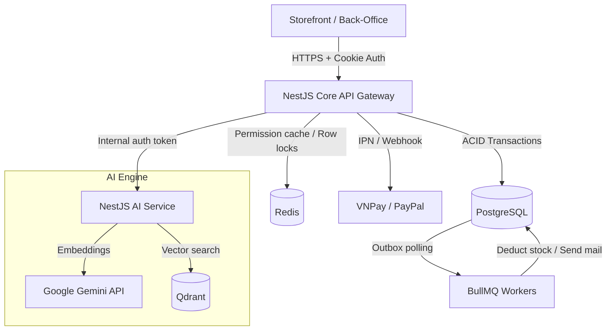
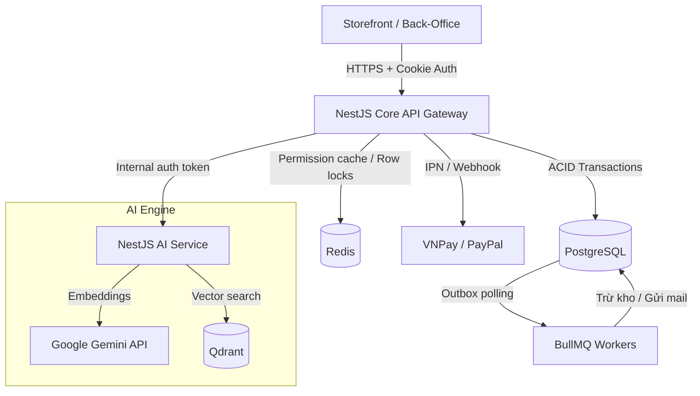

# 💍 Ray Paradis

[](https://nodejs.org/)
[](https://nestjs.com/)
[](https://react.dev/)
[](https://www.typescriptlang.org/)
[](https://www.postgresql.org/)
[](https://redis.io/)
[](https://qdrant.tech/)
[](https://www.terraform.io/)
[](https://kubernetes.io/)

[English](#english) | [Tiếng Việt](#tiếng-việt)

---

## English

### 1. Overview

**Ray Paradis** is a headless e-commerce platform engineered for the unique complexities of high-end jewelry retail — dynamic multi-variant matrices of metal, sizing, gem cut, and dynamically calculated pricing. It implements a **Modular Monolith core** with guarded checkout concurrency, backend-authoritative authorization, Redis-backed permission caching, and an independent service for AI-powered semantic similarity recommendations.

### 2. Core Capabilities

* **🔒 Atomic Stock Governance**: Row-level locks (`SELECT FOR UPDATE NOWAIT`) combined with an async outbox queue prevent database hangs and double-selling under high concurrency.
* **⚡ Active Authorization Caching**: User RBAC/ABAC role trees are flattened and cached inside Redis to avoid repeated PostgreSQL multi-table joins on protected requests.
* **🔄 Idempotent Payment Webhooks**: Replay-attack protection for VNPay and PayPal callbacks using unique transaction states and JWT `jti` (JWT ID) checking.
* **🛍️ Headless Storefront**: Feature-Sliced Design (FSD) React client built to eliminate suspense waterfalls and optimize Core Web Vitals (LCP, FID).
* **🧠 AI Embedding Search**: High-dimensional vector generation via Google Gemini API (`gemini-embedding-2`) mapped into a Qdrant Vector Database for similarity search, protected by a 3-state Circuit Breaker.

### 3. System Architecture



### 4. Monorepo Workspace Layout

```text
├── 📂 backend         # @ray-paradis/backend — NestJS Modular Monolith: 24 business modules, Prisma ORM, BullMQ
├── 📂 storefront      # @ray-paradis/storefront — React consumer SPA (Vite · TailwindCSS · TanStack Query · FSD)
├── 📂 back-office     # @ray-paradis/back-office — Operations portal for staff (React · Vite · Ant Design)
├── 📂 ai-service      # @ray-paradis/ai-service — NestJS embedding pipeline (Gemini · Qdrant · Circuit Breaker)
├── 📂 shared          # @ecommerce/shared — TypeScript types & Zod schemas shared across all workspaces
├── 📂 infra           # Docker Compose (dev) · K8s reference manifests · Terraform AWS starter
├── 📂 docs            # Mintlify docs: architecture · ADRs · module guides · API reference · runbooks
└── 📂 scripts         # Developer utility scripts
```

### 5. Technology Matrix

| Workspace | Technology Stack | Purpose / Boundary |
| :--- | :--- | :--- |
| **`backend`** | NestJS, Prisma ORM, PostgreSQL, Redis, BullMQ | Commerce core: transactions, state-machine, payment webhooks, permission enforcement. |
| **`storefront`** | React, Vite, TailwindCSS, Zustand, TanStack Query | Consumer client optimized for LCP/TTI, server-state caching via TanStack. |
| **`back-office`** | React, Vite, Ant Design | Operations interface: orders, inventory management, RBAC configuration. |
| **`ai-service`** | NestJS, BullMQ, Google Gemini API, Qdrant | Embedding pipeline with LRU cache, Token Bucket rate limiter, and Circuit Breaker. |
| **`shared`** | TypeScript, Zod | Single source of truth for DTOs and validation schemas across the monorepo. |
| **`infra`** | Docker Compose, Terraform, Kubernetes | Dev infrastructure + reference IaC (K8s/Terraform are starter templates, not production-complete). |

### 6. Quick Start

```bash
# 1. Clone the repository
git clone https://github.com/your-username/ray-paradis.git
cd ray-paradis

# 2. Provision local infrastructure (PostgreSQL · Redis · Qdrant · Mailpit)
docker compose -f infra/docker-compose.dev.yml up -d

# 3. Install workspace-wide dependencies
npm install

# 4. Run database migrations and seed mock data
cd backend && npx prisma migrate dev && npx prisma db seed && cd ..

# 5. Boot all workspaces in development mode
npm run dev
```

| Service | URL |
| :--- | :--- |
| Core Backend API | `http://localhost:4000` |
| Swagger API Docs | `http://localhost:4000/api/docs` |
| Storefront | `http://localhost:5173` |
| Back-Office | `http://localhost:3000` |
| Mailpit (email catcher) | `http://localhost:8025` |

### 7. Key Engineering Decisions

| Decision | Rationale |
| :--- | :--- |
| **Modular Monolith** | Cross-module ACID transactions (order + inventory) are trivial in a monolith; saga complexity of microservices is not warranted at this scale. |
| **HTTP-Only Cookie Auth** | Eliminates XSS token theft. Refresh tokens are path-restricted to `/api/auth/refresh` with rotation-on-use. |
| **`SELECT FOR UPDATE NOWAIT`** | Serializes concurrent checkouts for the same SKU. `withRetry` exponential backoff handles contention without blocking connections. |
| **Transactional Outbox** | Atomically couples order state change with downstream events (inventory deduction, email). No orphan jobs if DB transaction rolls back. |
| **Qdrant over pgvector** | Dedicated HNSW index with payload pre-filtering outperforms pgvector for semantic search. Isolated from primary DB load. |

### 8. Documentation

Full system documentation is in [`docs/`](./docs/) (powered by Mintlify):

| Section | Contents |
| :--- | :--- |
| [Getting Started](./docs/vi/getting-started/introduction.md) | Quick start, environment setup, project structure |
| [Architecture](./docs/vi/architecture/system-overview.md) | System diagrams, Modular Monolith design, concurrency, AI pipeline |
| [ADRs](./docs/vi/architecture/adr/) | Architecture Decision Records for every major design choice |
| [Development](./docs/vi/development/coding-conventions.md) | Coding conventions, testing strategy, Git branching, DB migration guide |
| [Module Guides](./docs/vi/modules/) | Per-module: domain model, state machine, API surface, permissions, failure cases |
| [API Reference](./docs/vi/api-reference/authentication.md) | Auth convention, error format, pagination, rate limiting (Swagger is the primary source) |
| [Operations](./docs/vi/operations/local-dev.md) | Local dev, deployment, environment variables, runbook |
| [Security](./docs/vi/security/overview.md) | Defense-in-depth layers, audit log, security checklist |

### 9. Runtime Readiness Notes

* **Tested locally**: Checkout idempotency, inventory row-level locking, payment webhook idempotency, refresh-token rotation, CSRF enforcement, permission-cache invalidation.
* **Local/staging infrastructure**: Docker Compose provisions PostgreSQL, Redis, Qdrant, and Mailpit. GitHub Actions CI gates: build, test, lint, security audit.
* **Infrastructure starters**: `infra/k8s/` and `infra/terraform/` are reference manifests — not a complete production platform without additional configuration (Ingress, TLS, secrets management, IAM).

---

## Tiếng Việt

### 1. Tổng quan

**Ray Paradis** là nền tảng thương mại điện tử headless được thiết kế riêng cho nghiệp vụ bán lẻ trang sức cao cấp — cấu hình biến thể đa chiều (chất liệu, size nhẫn, giác cắt đá) và tính giá động theo thị trường. Dự án xây dựng **lõi Modular Monolith** với cơ chế bảo vệ checkout đồng thời, phân quyền do backend kiểm soát tuyệt đối, cache quyền bằng Redis, và một service độc lập xử lý gợi ý sản phẩm ngữ nghĩa qua AI.

### 2. Các chức năng chính

* **🔒 Quản trị tồn kho Atomic**: Khóa dòng Postgres (`SELECT FOR UPDATE NOWAIT`) kết hợp hàng đợi sự kiện outbox bất đồng bộ — tránh treo DB và bán vượt tồn kho dưới tải cao.
* **⚡ Phân quyền có cache**: Toàn bộ quyền hạn RBAC/ABAC được làm phẳng và cache vào Redis — tránh lặp lại join nhiều bảng trên mỗi request cần phân quyền.
* **🔄 Idempotent Payment Webhooks**: Chống replay attack cho callback VNPay/PayPal bằng `providerTransactionId` unique constraint và đối soát JWT `jti` trong Redis.
* **🛍️ Giao diện Headless**: Client React theo chuẩn Feature-Sliced Design (FSD) — loại bỏ suspense waterfall và tối ưu Core Web Vitals (LCP, FID).
* **🧠 Tìm kiếm ngữ nghĩa AI**: Vector 768 chiều qua Google Gemini (`gemini-embedding-2`) lưu vào Qdrant, được bảo vệ bởi LRU Cache + Token Bucket + 3-State Circuit Breaker.

### 3. Kiến trúc hệ thống



### 4. Phân bổ thư mục monorepo

```text
├── 📂 backend         # @ray-paradis/backend — NestJS Modular Monolith: 24 modules nghiệp vụ, Prisma ORM, BullMQ
├── 📂 storefront      # @ray-paradis/storefront — React SPA cho khách hàng (Vite · TailwindCSS · TanStack Query)
├── 📂 back-office     # @ray-paradis/back-office — Giao diện vận hành cho nhân sự (React · Vite · Ant Design)
├── 📂 ai-service      # @ray-paradis/ai-service — Pipeline vector embedding (Gemini · Qdrant · Circuit Breaker)
├── 📂 shared          # @ecommerce/shared — TypeScript types & Zod schemas dùng chung toàn monorepo
├── 📂 infra           # Docker Compose (dev) · K8s reference manifests · Terraform AWS starter
├── 📂 docs            # Tài liệu Mintlify: kiến trúc · ADRs · module guides · API reference · runbook
└── 📂 scripts         # Scripts tiện ích cho developer
```

### 5. Bảng công nghệ sử dụng

| Workspace | Công nghệ | Vai trò nghiệp vụ |
| :--- | :--- | :--- |
| **`backend`** | NestJS, Prisma ORM, PostgreSQL, Redis, BullMQ | Lõi giao dịch thương mại, state-machine, webhook cổng thanh toán, kiểm soát phân quyền. |
| **`storefront`** | React, Vite, TailwindCSS, Zustand, TanStack Query | Client mua sắm của khách hàng, tối ưu LCP/TTI, cache dữ liệu server riêng biệt. |
| **`back-office`** | React, Vite, Ant Design | Giao diện vận hành: đơn hàng, kho bãi, cấu hình phân quyền cho nhân sự. |
| **`ai-service`** | NestJS, BullMQ, Google Gemini API, Qdrant | Pipeline tạo vector embedding với LRU Cache, Token Bucket và Circuit Breaker bảo vệ quota. |
| **`shared`** | TypeScript, Zod | Nguồn chân lý duy nhất cho DTOs và Zod schema dùng chung trên toàn monorepo. |
| **`infra`** | Docker Compose, Terraform, Kubernetes | Hạ tầng dev + reference IaC (K8s/Terraform là starter templates, chưa phải production-complete). |

### 6. Hướng dẫn khởi chạy nhanh

```bash
# 1. Clone mã nguồn
git clone https://github.com/your-username/ray-paradis.git
cd ray-paradis

# 2. Khởi động hạ tầng local (PostgreSQL · Redis · Qdrant · Mailpit)
docker compose -f infra/docker-compose.dev.yml up -d

# 3. Cài đặt dependencies toàn workspace
npm install

# 4. Chạy migrations và seed dữ liệu mẫu
cd backend && npx prisma migrate dev && npx prisma db seed && cd ..

# 5. Khởi động tất cả services ở chế độ dev
npm run dev
```

| Service | URL |
| :--- | :--- |
| Backend API | `http://localhost:4000` |
| Swagger API Docs | `http://localhost:4000/api/docs` |
| Storefront | `http://localhost:5173` |
| Back-Office | `http://localhost:3000` |
| Mailpit (bắt email) | `http://localhost:8025` |

**Tài khoản mặc định sau seed:**

| Role | Email | Password |
| :--- | :--- | :--- |
| Super Admin | `admin@rayparadis.com` | `Admin@123` |
| Quản lý | `manager@rayparadis.com` | `Manager@123` |
| Nhân viên kho | `warehouse@rayparadis.com` | `Warehouse@123` |

### 7. Quyết định Kiến trúc Quan trọng

| Quyết định | Lý do | Chi tiết |
| :--- | :--- | :--- |
| **Modular Monolith** | Transaction ACID cross-module (order + inventory) không cần saga | [ADR-001](./docs/vi/architecture/adr/001-modular-monolith.md) |
| **HTTP-Only Cookie Auth** | Chống XSS token theft, refresh token path-restricted | [ADR-002](./docs/vi/architecture/adr/002-http-only-cookie-auth.md) |
| **`SELECT FOR UPDATE NOWAIT`** | Serialize concurrent checkout, không block connection pool | [ADR-003](./docs/vi/architecture/adr/003-inventory-locking-strategy.md) |
| **Transactional Outbox** | Atomic coupling order state + downstream events, không orphan job | [ADR-004](./docs/vi/architecture/adr/004-outbox-pattern.md) |
| **Qdrant thay vì pgvector** | HNSW index + payload pre-filtering, tách tải khỏi primary DB | [ADR-005](./docs/vi/architecture/adr/005-vector-search-qdrant.md) |

### 8. Tài liệu

Toàn bộ tài liệu hệ thống trong [`docs/`](./docs/) (Mintlify):

| Nhóm | Nội dung |
| :--- | :--- |
| [Bắt đầu](./docs/vi/getting-started/introduction.md) | Quick start, cấu hình env, cấu trúc project |
| [Kiến trúc](./docs/vi/architecture/system-overview.md) | Sơ đồ hệ thống, Modular Monolith, concurrency control, AI pipeline |
| [ADRs](./docs/vi/architecture/adr/) | Architecture Decision Records cho từng quyết định thiết kế lớn |
| [Development](./docs/vi/development/coding-conventions.md) | Coding conventions, testing strategy, Git branching, hướng dẫn migration DB |
| [Phân hệ nghiệp vụ](./docs/vi/modules/) | Từng module: domain model, state machine, API, permissions, failure cases |
| [API Reference](./docs/vi/api-reference/authentication.md) | Convention xác thực, format lỗi, pagination, rate limit (Swagger là nguồn chính) |
| [Vận hành](./docs/vi/operations/local-dev.md) | Local dev, deployment, biến môi trường, runbook xử lý sự cố |
| [Bảo mật](./docs/vi/security/overview.md) | Defense-in-depth layers, audit log, checklist bảo mật định kỳ |

### 9. Ghi chú Độ sẵn sàng

* **Đã test local**: Checkout idempotency, inventory row-level locking, payment webhook idempotency, refresh-token rotation, CSRF enforcement, permission-cache invalidation.
* **Hạ tầng local/staging**: Docker Compose cho PostgreSQL, Redis, Qdrant, Mailpit. CI GitHub Actions: build, test, lint, security audit.
* **Hạ tầng reference**: `infra/k8s/` và `infra/terraform/` là starter templates — cần bổ sung thêm (Ingress, TLS, secret management) trước khi dùng production thực sự.
