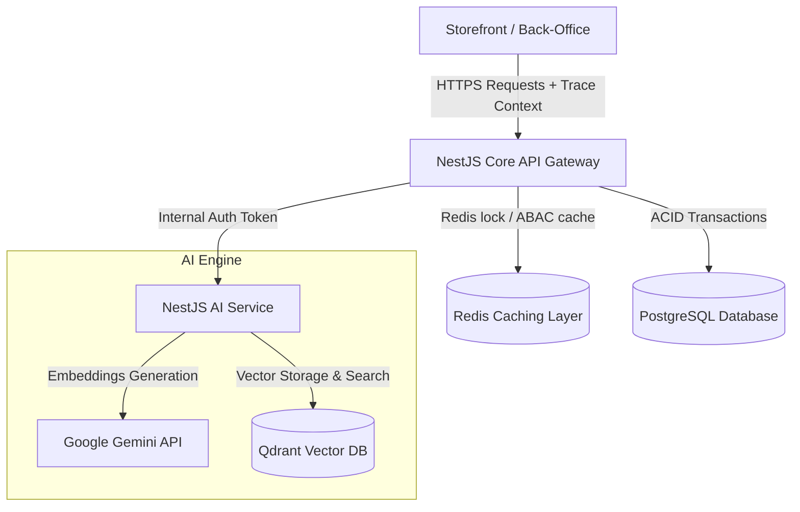

[ignoring loop detection]
# 💍 Ray Paradis

[](https://nodejs.org/)
[](https://nestjs.com/)
[](https://react.dev/)
[](https://www.typescriptlang.org/)
[](https://www.postgresql.org/)
[](https://redis.io/)
[](https://qdrant.tech/)
[](https://www.terraform.io/)
[](https://kubernetes.io/)

[English](#english) | [Tiếng Việt](#tiếng-việt)

---

## English

### 1. Overview
**Ray Paradis** is a distributed, headless e-commerce platform engineered for the unique complexities of high-end jewelry retail (dynamic multi-variant matrices of metal, sizing, gem cut, and dynamically calculated pricing). It implements a **Modular Monolith core** optimized for high-concurrency checkouts, zero-trust authorization, sub-10ms cache retrieval, and an independent microservice for AI-powered semantic similarity recommendations.

### 2. Core Capabilities
* **🔒 Atomic Stock Governance**: Row-level locks (`SELECT FOR UPDATE NOWAIT`) combined with an async outbox queue prevent database hangs and double-selling under high concurrency.
* **⚡ Active Authorization Caching**: User RBAC/ABAC role trees are flattened and cached inside Redis, reducing validation latency from ~50ms (PostgreSQL join) to **<0.5ms** on every request.
* **🔄 Idempotent Payment Webhooks**: Replay-attack protection for VNPay and PayPal callbacks using unique transaction states and JWT `jti` (JWT ID) checking.
* **🛍️ Headless Storefront**: Feature-Sliced Design (FSD) React client built to eliminate suspense waterfalls and optimize Core Web Vitals (LCP, FID).
* **🧠 AI Embedding Search**: High-dimensional vector generation via Google Gemini API (`gemini-embedding-2`) mapped into a Qdrant Vector Database for similarity search.

### 3. System Architecture


### 4. Monorepo Workspace Layout
```text
├── 📂 backend         # @ray-paradis/backend: NestJS Core API, state-machine, & database migrations
├── 📂 storefront      # @ray-paradis/storefront: React consumer SPA (Vite + TailwindCSS + TanStack Query)
├── 📂 back-office     # @ray-paradis/back-office: Operations and administrative React portal (Ant Design)
├── 📂 ai-service      # @ray-paradis/ai-service: NestJS recommendation vector generation & retrieval service
├── 📂 shared          # @ecommerce/shared: Global TypeScript types, Zod schemas, and universal contracts
├── 📂 infra           # Infrastructure IaC: AWS Terraform modules & Kubernetes (K8s) manifests
└── 📂 docs            # Standardized system design, sequence flows, and runbooks
```

### 5. Technology Matrix
| Workspace | Technology Stack | Purpose / Boundary |
| :--- | :--- | :--- |
| **`backend`** | NestJS, Node.js, Prisma ORM, PostgreSQL, Redis, BullMQ | Commerce core database logic, transactions, state-machine, webhook endpoints. |
| **`storefront`** | React, Vite, TailwindCSS, Zustand, TanStack Query | Consumer client app optimized for fast LCP/TTI, caching server states separately. |
| **`back-office`** | React, Vite, Ant Design | Operations administrative interface for order processing, inventory, and RBAC mapping. |
| **`ai-service`**| NestJS, Redis, BullMQ, Google Gemini API, Qdrant Vector DB | Specialized embedding pipeline, caching search results, rate-limit safeguards. |
| **`shared`** | TypeScript, Zod | Type safety, validations, and DTO definitions shared between all front/back workspaces. |
| **`infra`** | Terraform, Kubernetes, Docker, Helm, AWS | Infrastructure as Code (VPC, private subnetting) & automated scaling deployments. |

### 6. Quick Start & Onboarding
```bash
# Clone and enter the repository
git clone https://github.com/your-username/ray-paradis.git
cd ray-paradis

# 1. Provision PostgreSQL, Redis, and Qdrant infrastructure
docker compose -f infra/docker-compose.dev.yml up -d

# 2. Install workspace-wide dependencies
npm install

# 3. Synchronize database schema and seed mock data
cd backend
npx prisma migrate dev
npx prisma db seed
cd ..

# 4. Boot all workspaces in development mode
npm run dev --workspaces
```
* Core Backend API: `http://localhost:4000`
* Vite Storefront: `http://localhost:5173`
* Operations Back-Office: `http://localhost:3000`
* Mailpit Local Inbox: `http://localhost:8025`

### 7. Core Engineering Decisions (Deep Dive)
* **Modular Monolith core**: Keeps modules strictly isolated by NestJS Dependency Injection. Prisma Query Extensions throw database-level exceptions if outside controllers try to query databases directly bypassing Services.
* **Nowait DB Reservation**: Executes `SELECT FOR UPDATE NOWAIT` on PostgreSQL rows. An exponential backoff helper `withRetry` retries lock acquisitions up to 5 times.
* **Transactional Outbox**: Decouples orders from inventory events using `DomainEventOutbox` and BullMQ background workers to maintain eventual consistency.
* **Active Authorization Cache**: Flattens roles at login and caches them in Redis to resolve privileges in under **0.5ms**.
* **AI Vector Resilience**: Protects Google Gemini calls with local **LRU Cache**, **Token Bucket Rate Limiter**, and **3-State Circuit Breaker** to prevent cascading failures.

---

## Tiếng Việt

### 1. Tổng quan
**Ray Paradis** là một nền tảng thương mại điện tử headless (không đầu), phân tán, được thiết kế cho các nghiệp vụ trang sức xa xỉ phức tạp (cấu hình biến thể đa chiều gồm chất liệu, size nhẫn, giác cắt đá, và cách tính giá động). Dự án phát triển **lõi Modular Monolith** tối ưu cho việc thanh toán đồng thời cao, phân quyền bảo mật zero-trust, phản hồi cache dưới 10ms và một microservice độc lập xử lý gợi ý sản phẩm ngữ nghĩa qua AI.

### 2. Các chức năng chính
* **🔒 Quản trị tồn kho Atomic**: Áp dụng cơ chế khóa dòng Postgres (`SELECT FOR UPDATE NOWAIT`) kết hợp hàng đợi sự kiện outbox bất đồng bộ để tránh treo DB và bán vượt tồn kho dưới tải cao.
* **⚡ Phân quyền hiệu năng cao**: Toàn bộ danh sách quyền hạn được làm phẳng và lưu ở Redis, giảm độ trễ xác thực từ ~50ms (SQL Join) xuống **<0.5ms** trên mỗi request.
* **🔄 Idempotent Payment Webhooks**: Chống tấn công lặp lại (replay attacks) cho các callback VNPay/PayPal bằng trạng thái giao dịch duy nhất và đối soát JWT `jti` (JWT ID).
* **🛍️ Giao diện Headless**: Client React phát triển theo chuẩn thiết kế Feature-Sliced Design (FSD) loại bỏ hiện tượng giật lag màn hình và tối ưu hóa các chỉ số Core Web Vitals (LCP, FID).
* **🧠 Tìm kiếm ngữ nghĩa AI**: Tự động chuyển siêu dữ liệu sản phẩm thành vector 768 chiều qua Google Gemini (`gemini-embedding-2`) và lưu vào Qdrant Vector DB để truy vấn gợi ý.

### 3. Kiến trúc hệ thống


### 4. Phân bổ thư mục monorepo
```text
├── 📂 backend         # @ray-paradis/backend: NestJS Core API, quản lý transaction & migrations
├── 📂 storefront      # @ray-paradis/storefront: React consumer SPA (Vite + TailwindCSS + TanStack Query)
├── 📂 back-office     # @ray-paradis/back-office: Giao diện quản trị & vận hành (React + Ant Design)
├── 📂 ai-service      # @ray-paradis/ai-service: Microservice NestJS xử lý và đồng bộ vector AI
├── 📂 shared          # @ecommerce/shared: Kiểu TypeScript, Zod schema dùng chung cho toàn bộ dự án
├── 📂 infra           # Cơ sở hạ tầng IaC: AWS Terraform modules & Kubernetes manifests
└── 📂 docs            # Tài liệu thiết kế hệ thống, sơ đồ tuần tự và kịch bản vận hành
```

### 5. Bảng công nghệ sử dụng
| Workspace | Công nghệ sử dụng | Vai trò nghiệp vụ |
| :--- | :--- | :--- |
| **`backend`** | NestJS, Node.js, Prisma ORM, PostgreSQL, Redis, BullMQ | Lõi xử lý giao dịch thương mại, database migrations, webhook cổng thanh toán. |
| **`storefront`** | React, Vite, TailwindCSS, Zustand, TanStack Query | Client mua sắm của khách hàng, tối ưu LCP/TTI, cache dữ liệu server riêng biệt. |
| **`back-office`** | React, Vite, Ant Design | Giao diện vận hành đơn hàng, kho bãi và cấu hình quyền hạn cho nhân sự. |
| **`ai-service`**| NestJS, Redis, BullMQ, Google Gemini API, Qdrant Vector DB | Xử lý ngầm tạo vector nhúng, lưu trữ vector DB và tối ưu quota gọi AI. |
| **`shared`** | TypeScript, Zod | Định nghĩa DTOs, Zod schema dùng chung cho cả backend lẫn frontend. |
| **`infra`** | Terraform, Kubernetes, Docker, Helm, AWS | Hạ tầng khai báo IaC (phân vùng mạng VPC) & cấu hình co giãn Pod K8s. |

### 6. Hướng dẫn khởi chạy nhanh
```bash
# Clone và truy cập mã nguồn
git clone https://github.com/your-username/ray-paradis.git
cd ray-paradis

# 1. Khởi động PostgreSQL, Redis, và Qdrant local bằng Docker
docker compose -f infra/docker-compose.dev.yml up -d

# 2. Cài đặt các thư viện toàn hệ thống
npm install

# 3. Đồng bộ cấu trúc bảng và nạp dữ liệu mẫu
cd backend
npx prisma migrate dev
npx prisma db seed
cd ..

# 4. Chạy toàn bộ workspaces ở chế độ phát triển (dev mode)
npm run dev --workspaces
```
* Core Backend API: `http://localhost:4000`
* Vite Storefront: `http://localhost:5173`
* Operations Back-Office: `http://localhost:3000`
* Mailpit Local Inbox: `http://localhost:8025`

### 7. Chi tiết quyết định kiến trúc
* **Lõi Modular Monolith**: Độc lập hóa các module nghiệp vụ qua NestJS DI. Sử dụng Prisma Query Extension để tự động chặn các truy vấn sửa đổi database trực tiếp không qua tầng Service được quy định.
* **Đặt chỗ tồn kho Nowait**: Thực thi `SELECT FOR UPDATE NOWAIT` trên dòng Postgres. Hỗ trợ cơ chế thử lại tự động `withRetry` tối đa 5 lần để xử lý xung đột khóa dòng.
* **Domain Decoupling qua Outbox**: Phân tách luồng thanh toán và trừ kho thông qua bảng trung gian `DomainEventOutbox` và BullMQ worker chạy ngầm để bảo đảm tính nhất quán sau cùng.
* **Cache phân quyền động**: Flatten danh sách phân quyền của User tại thời điểm đăng nhập và cache vào Redis giúp phân quyền thời gian thực chỉ mất **<0.5ms**.
* **Độ bền bỉ của AI Pipeline**: Bảo vệ Gemini API hạn mức gọi bằng **LRU Cache**, bộ lọc tần suất **Token Bucket** và bộ ngắt mạch tự động **3-State Circuit Breaker** tránh sập hệ thống dây chuyền.
