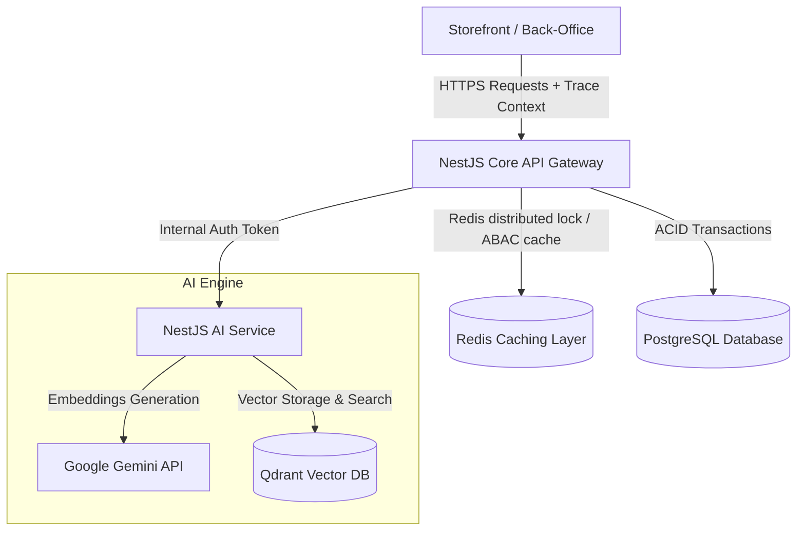

# 💍 Ray Paradis

[](https://nodejs.org/)
[](https://nestjs.com/)
[](https://react.dev/)
[](https://www.typescriptlang.org/)
[](https://www.postgresql.org/)
[](https://redis.io/)
[](https://qdrant.tech/)
[](https://www.terraform.io/)
[](https://kubernetes.io/)

> **A production-ready, headless e-commerce engine engineered for luxury multi-variant catalog logic, hyper-concurrent flash-sale stock reservation, and AI-driven semantic recommendation search.**

---

## 📖 Table of Contents
1. [Overview](#-overview)
2. [Core Capabilities](#-core-capabilities)
3. [System Architecture](#-system-architecture)
4. [Monorepo Workspace Layout](#-monorepo-workspace-layout)
5. [Technology Matrix](#-technology-matrix)
6. [Quick Start & Onboarding](#-quick-start--onboarding)
7. [Core Engineering Decisions (Deep Dive)](#-core-engineering-decisions-deep-dive)
8. [Interviewer's Guide: Code Walkthrough Paths](#-interviewers-guide-code-walkthrough-paths)
9. [Documentation System](#-documentation-system)

---

## 🧠 Overview

**Ray Paradis** is a distributed, headless e-commerce platform designed to address the unique complexities of high-end jewelry retail (e.g. dynamic multi-variant combinations of metal, sizing, gem cut, and dynamic pricing). 

Unlike traditional monolith e-commerce systems, Ray Paradis uses a **Modular Monolith core** optimized for high-concurrency checkout security, zero-trust authorization, sub-10ms cache checking, and an independent microservice for AI-powered semantic similarity recommendation loops.

---

## ✨ Core Capabilities

* **🔒 Atomic Stock Governance**: Row-level locks (`SELECT FOR UPDATE NOWAIT`) combined with an async outbox queue prevent database connection hangs and overselling under high concurrency.
* **⚡ Active Authorization Caching**: User RBAC/ABAC role trees are flattened at login and cached inside Redis, cutting verification latency from ~50ms (PostgreSQL join) to **<0.5ms** (Redis read) on every API request.
* **🔄 Idempotent Payment Webhooks**: Replay-attack protection for VNPay and PayPal callbacks using unique transaction states and JWT `jti` (JWT ID) checking.
* **🛍️ Headless Storefront**: Feature-Sliced Design (FSD) React client built to eliminate global React Suspense waterfalls, optimizing Core Web Vitals (LCP, FID) and maintaining 60fps micro-interactions.
* **🧠 AI Embedding Search**: High-dimensional vector generation via Google Gemini API (`gemini-embedding-2`) mapped into a Qdrant Vector Database for fast cosine-similarity product recommendations.

---

## 🧩 System Architecture

The core transaction processing engine is built as a Modular Monolith in NestJS. Auxiliary heavy-computation engines (like vector retrieval) are decoupled into isolated services.



---

## 📂 Monorepo Workspace Layout

Managed via NPM Workspaces to maintain strict module borders and universal data models:

```text
├── 📂 backend         # @ray-paradis/backend: NestJS Core API, state-machine, & database migrations
├── 📂 storefront      # @ray-paradis/storefront: React consumer SPA (Vite + TailwindCSS + TanStack Query)
├── 📂 back-office     # @ray-paradis/back-office: Operations and administrative React portal (Ant Design)
├── 📂 ai-service      # @ray-paradis/ai-service: NestJS recommendation vector generation & retrieval service
├── 📂 shared          # @ecommerce/shared: Global TypeScript types, Zod schemas, and universal contracts
├── 📂 infra           # Infrastructure IaC: AWS Terraform modules & Kubernetes (K8s) manifests
└── 📂 docs            # Standardized system design, sequence flows, and runbooks
```

---

## 🛠️ Technology Matrix

| Workspace | Technology Stack | Purpose / Boundary |
| :--- | :--- | :--- |
| **`backend`** | NestJS, Node.js, Prisma ORM, PostgreSQL, Redis, BullMQ | Commerce core database logic, transactions, state-machine, webhook endpoints. |
| **`storefront`** | React, Vite, TailwindCSS, Zustand, TanStack Query | Consumer client app optimized for fast LCP/TTI, caching server states separately. |
| **`back-office`** | React, Vite, Ant Design | Operations administrative interface for order processing, inventory, and RBAC mapping. |
| **`ai-service`**| NestJS, Redis, BullMQ, Google Gemini API, Qdrant Vector DB | Specialized embedding pipeline, caching search results, rate-limit safeguards. |
| **`shared`** | TypeScript, Zod | Type safety, validations, and DTO definitions shared between all front/back workspaces. |
| **`infra`** | Terraform, Kubernetes, Docker, Helm, AWS | Infrastructure as Code (VPC, private subnetting) & automated scaling deployments. |

---

## ⚡ Quick Start & Onboarding

### 1. Pre-requisites
Ensure you have the following installed on your host system:
* Node.js `v20+` & NPM `v9+`
* Docker Engine & Docker Compose

### 2. Dev Environment Boot
Follow these steps to boot up database dependencies, run migrations, and launch local servers:

```bash
# Clone and enter the repository
git clone https://github.com/your-username/ray-paradis.git
cd ray-paradis

# 1. Provision PostgreSQL, Redis, and Qdrant infrastructure
docker compose -f infra/docker-compose.dev.yml up -d

# 2. Install workspace-wide dependencies
npm install

# 3. Synchronize database schema and seed mock data
cd backend
npx prisma migrate dev
npx prisma db seed
cd ..

# 4. Boot all workspaces in development mode
npm run dev --workspaces
```

* **Core Backend API**: Runs on `http://localhost:4000`
* **Vite Storefront**: Runs on `http://localhost:5173`
* **Operations Back-Office**: Runs on `http://localhost:3000`
* **Qdrant Dashboard**: Runs on `http://localhost:6333/dashboard`

---

## 🚀 Core Engineering Decisions (Deep Dive)

### 1. Pragmatic Modular Monolith
To prevent unnecessary network overhead and distributed transaction (Saga) patterns in early scaling phases, we implement a **Modular Monolith** using **NestJS**. Domains like `Order` and `Inventory` remain strictly isolated by NestJS Dependency Injection. An internal `Prisma Query Extension` checks execution contexts dynamically, throwing database-level exceptions if one module attempts to bypass services and write directly to another module's database tables.

### 2. High-Concurrency Stock Locking
To handle flash-sales for luxury jewelry:
* **Pre-Check Cache Lock**: Decrements SKU values atomically in Redis (`DECRBY`) before touching database transactions. If the Redis value goes below zero, the request fails fast.
* **Nowait DB Reservation**: Executes `SELECT FOR UPDATE NOWAIT` on PostgreSQL rows. Instead of queueing requests (which spikes CPU usage and exhausts database pools), the transaction fails fast upon collision.
* **Exponential Backoff**: A `withRetry` helper catches database lock failures and retries up to 5 times with growing intervals to resolve lock contentions smoothly.

### 3. Event-Driven Domain Decoupling
Rather than maintaining active database transactions that lock both `Order` and `InventoryItem` tables during checkout, we use the **Transactional Outbox Pattern** (`DomainEventOutbox`). When an order is created, an event is written to the Outbox table in the same database transaction. A separate background worker processes this queue, maintaining **Eventual Consistency** between domains and boosting checkout write speeds.

### 4. Active Authorization Cache
Querying user roles, access matrices, and permissions requires joining 4+ relational tables in Postgres (Users, Roles, Permissions, etc.). To bypass this tax on every API call:
* The entire permission tree is flattened at login and cached inside a Redis in-memory lookup map.
* API authorization checks complete in under **0.5ms**, avoiding database queries entirely.
* A pattern-based invalidation (`DEL session:powers:*`) flushes the cache if roles are changed by an administrator.

### 5. AI Vector Resilience
The embedding service (`ai-service`) translates catalog text into 768-dimensional vectors using Google Gemini API and stores them in Qdrant. Because external API quotas are highly volatile:
* We deploy a custom in-memory **LRU Cache** to save generated vectors.
* An internal **Token Bucket Rate Limiter** limits client sync requests.
* Calls to Gemini are protected by a **3-State Circuit Breaker** and **Exponential Backoff Retries** to prevent cascading failures if the AI API suffers an outage.

### 6. Full-Stack Tracing & Correlation
To troubleshoot performance drops in production, a `traceparent` (W3C Trace Context) and `x-correlation-id` header is generated in the storefront Axios interceptor and forwarded to the backend. It propagates through NestJS middlewares to SQL queries and AI logs, allowing end-to-end tracing across services.

---

## 🧭 Interviewer's Guide: Key Code Paths

To review the implementation of the design decisions outlined above, check the following source files:

1. **Transactional Outbox & Domain Decoupling**  
   📄 [`backend/src/modules/order/order.service.ts`](./backend/src/modules/order/order.service.ts) - *Outbox record generation in `transitionTo` and async decoupling in `processInventoryDeduction`.*

2. **Distributed Locks & Concurrency Guards**  
   📄 [`backend/src/modules/infra/distributed-lock.service.ts`](./backend/src/modules/infra/distributed-lock.service.ts) - *Redis NX/PX locking routines and cache decrement guards.*

3. **AI Integration, Circuit Breaker, & Retries**  
   📄 [`ai-service/src/core/embedding/embedding.service.ts`](./ai-service/src/core/embedding/embedding.service.ts) - *Gemini embeddings integration protected by Circuit Breakers, LRU caches, and retry mechanisms.*

4. **Distributed Correlation Tracing**  
   📄 Client Interceptor: [`storefront/src/services/apiClient.ts`](./storefront/src/services/apiClient.ts)  
   📄 Backend Middleware: [`backend/src/common/middlewares/correlation-id.middleware.ts`](./backend/src/common/middlewares/correlation-id.middleware.ts)

5. **Token Replay & Idempotency**  
   📄 [`backend/src/modules/payment/services/idempotency.service.ts`](./backend/src/modules/payment/services/idempotency.service.ts) - *Webhook idempotency checks.*

6. **Client-side Authorization Security**  
   📄 [`storefront/FRONTEND_SECURITY.md`](./storefront/FRONTEND_SECURITY.md) - *Detailed explanation of CSRF validation and session binding.*

---

## 📖 Documentation System

This codebase is supported by a standardized, internal documentation portal located in `docs/`:
* **Global Overview**: Read [`docs/README.md`](./docs/README.md) for navigation guides.
* **System Design**: Learn about core components and design rules in [`docs/system/architecture.md`](./docs/system/architecture.md).
* **Operational Runbooks**: Review recovery metrics and incident playbooks in [`docs/ops/runbooks/incident-response.md`](./docs/ops/runbooks/incident-response.md).