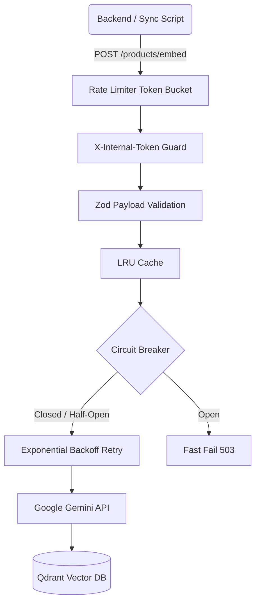

# AI Recommendation Flow

The Ray Paradis recommendation engine operates by transforming textual product attributes into high-dimensional vectors (Embeddings) via Google Gemini, then executing semantic similarity searches using the Qdrant Vector Database.

## 1. Data Synchronization (Ingestion Flow)

Product data must be synchronized from PostgreSQL to Qdrant to power the recommendation engine.

1. **Trigger**: An administrative script (`backend/src/scripts/sync-ai-products.ts`) or a cron job initiates the sync.
2. **Data Assembly**: The backend fetches products and their categories from PostgreSQL and formats them into a flat text payload.
3. **Authentication**: The backend sends a `POST /products/embed` request to the AI Service, attaching the `X-Internal-Token` to bypass IP rate limits.
4. **Pacing**: The sync script delays requests to respect the Gemini Free Tier quota (15 RPM).
5. **AI Service Processing**:
    - **Validation**: Payload is validated against Zod schema (`ProductEmbeddingSchema`).
    - **Embedding Generation**: The `EmbeddingPipeline` calls Gemini API (`gemini-embedding-2`).
    - **Resilience**: If Gemini times out or rate limits, the request is retried with **Exponential Backoff**. If consecutive failures exceed the threshold, the **Circuit Breaker** trips to OPEN.
    - **Vector Storage**: Upon successful embedding, the 768-dimensional vector is pushed to Qdrant.

## 2. Recommendation Retrieval (Serving Flow)

When a user visits a product details page, the storefront requests "Similar Products".

1. **Storefront Request**: The Storefront hits the Backend API `/api/products/:id/recommendations`.
2. **Backend Delegation**: The Backend passes the request to the AI Service via `GET /recommendations?productId=X`.
3. **Cache Check**: The AI Service checks its **In-Memory LRU Cache**. If the embedding for `productId=X` exists, it skips the Gemini API call completely.
4. **Similarity Search**: The AI Service sends the base vector to Qdrant, requesting the top $N$ closest neighbors via Cosine Similarity.
5. **Enrichment**: The AI Service returns the matching Product IDs to the Backend. The Backend fetches the full product details (prices, inventory, images) from PostgreSQL and sends the final response to the Storefront.

## 3. Resilience & Hardening Diagram
The AI Service is protected by multiple layers:

