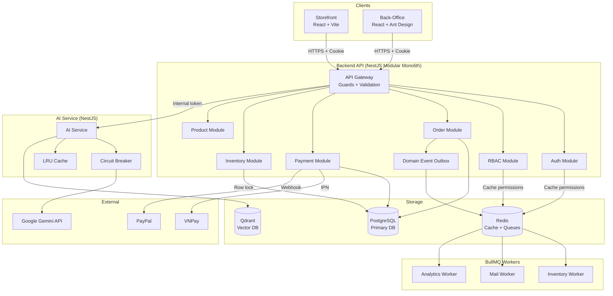
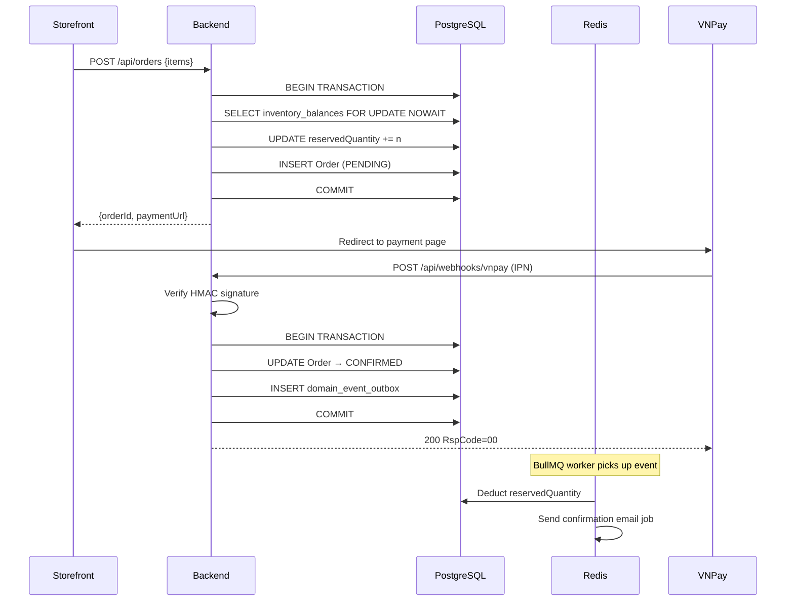

# Kiến trúc Hệ thống — Tổng quan

## Sơ đồ Tổng thể

---

## Luồng Checkout (Critical Path)

---

## Quyết định Kiến trúc Quan trọng

| Quyết định | Tham khảo |
|-----------|-----------|
| Tại sao Modular Monolith? | [ADR-001](./adr/001-modular-monolith.md) |
| Tại sao HTTP-Only Cookie? | [ADR-002](./adr/002-http-only-cookie-auth.md) |
| Tại sao Pessimistic Locking? | [ADR-003](./adr/003-inventory-locking-strategy.md) |
| Tại sao Outbox Pattern? | [ADR-004](./adr/004-outbox-pattern.md) |
| Tại sao Qdrant thay vì pgvector? | [ADR-005](./adr/005-vector-search-qdrant.md) |
