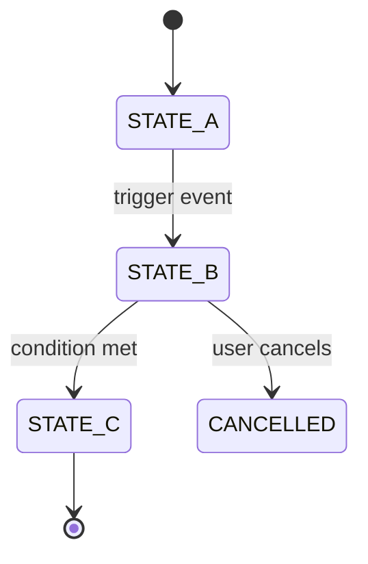

# Module Template — Cấu trúc Chuẩn

> **Hướng dẫn sử dụng**: Copy file này khi tạo docs cho một phân hệ mới. Giữ nguyên 8 mục, điền nội dung thực tế. Không bỏ mục nào — nếu chưa có thể ghi `_Chưa áp dụng_`.

---

# [Tên Phân hệ]

> Một câu mô tả ngắn: phân hệ này giải quyết vấn đề gì và thuộc phạm vi nào trong hệ thống.

---

## 1. Business Context

**Tại sao phân hệ này tồn tại?**

Mô tả bài toán nghiệp vụ cụ thể mà module giải quyết. Tránh copy-paste technical description — hãy viết theo góc nhìn của người vận hành hoặc khách hàng.

**Actors chính:**
- `[Role A]` — làm gì với module này
- `[Role B]` — làm gì với module này

**Ranh giới nghiệp vụ (Domain Boundary):**
- ✅ Thuộc phạm vi module này: ...
- ❌ Không thuộc phạm vi (handled by module khác): ...

---

## 2. Domain Model

Các entity chính và quan hệ giữa chúng.

```prisma
// Tóm tắt Prisma model — chỉ giữ các field quan trọng nhất
model ExampleEntity {
  id        String   @id @default(uuid()) @db.Uuid
  status    Status   @default(PENDING)
  createdAt DateTime @default(now())
}
```

**Giải thích các field quan trọng:**
| Field | Ý nghĩa | Ghi chú |
|-------|---------|---------|
| `status` | Trạng thái hiện tại | Xem State Machine bên dưới |
| `field2` | ... | ... |

---

## 3. State Machine / Flow

> Dùng Mermaid diagram để mô tả luồng trạng thái hoặc sequence diagram cho flow phức tạp.

**State Machine:**


**Mô tả các transition:**
| Từ | Đến | Trigger | Điều kiện |
|----|-----|---------|-----------|
| `STATE_A` | `STATE_B` | ... | ... |

---

## 4. API Surface

> **Nguồn chính xác nhất**: Swagger UI tại `http://localhost:4000/api/docs` (filter theo tag `[Module Name]`).

Tóm tắt các nhóm endpoint:

| Method | Path | Mô tả | Auth yêu cầu |
|--------|------|--------|--------------|
| `GET` | `/api/[resource]` | Lấy danh sách | `Bearer` hoặc `Cookie` |
| `POST` | `/api/[resource]` | Tạo mới | `Bearer` hoặc `Cookie` |
| `PATCH` | `/api/[resource]/:id` | Cập nhật | `Bearer` hoặc `Cookie` |

**Admin endpoints** (prefix `/api/admin/`):
| Method | Path | Permission yêu cầu |
|--------|------|--------------------|
| ... | ... | ... |

---

## 5. Permissions

Permission slugs từ [`permissions.constants.ts`](file:///e:/Ray%20Paradis/backend/src/modules/rbac/permissions.constants.ts) liên quan đến module này:

| Permission Slug | Hành động được phép |
|-----------------|---------------------|
| `[domain].[resource].read` | Xem danh sách và chi tiết |
| `[domain].[resource].create` | Tạo mới |
| `[domain].[resource].update` | Cập nhật |
| `[domain].[resource].delete` | Xóa / vô hiệu hóa |

**Guard áp dụng**: `@RequirePermissions('[slug]')` từ [`rbac.guard.ts`](file:///e:/Ray%20Paradis/backend/src/modules/rbac/guards/rbac.guard.ts)

---

## 6. Events / Jobs

**Domain Events phát ra** (qua `DomainEventOutbox`):
| Event Name | Phát khi | Consumer |
|------------|----------|----------|
| `[domain].[event]` | ... | Module X |

**BullMQ Jobs**:
| Queue | Job | Trigger | Retry policy |
|-------|-----|---------|--------------|
| `[queue-name]` | `[job-name]` | ... | 3 lần, exponential backoff |

> Nếu module không có events/jobs: `_Không có background jobs trong phân hệ này._`

---

## 7. Failure Cases

Các edge case và cách hệ thống xử lý:

| Tình huống | Hành vi hệ thống | HTTP Status |
|------------|------------------|-------------|
| Dữ liệu không tìm thấy | Throw `NotFoundException` | `404` |
| Race condition / conflict | ... | `409` |
| Quyền không đủ | `ForbiddenException` từ RBAC guard | `403` |
| Idempotency key trùng | Return kết quả cũ, không thực thi lại | `200` |

---

## 8. Testing Notes

**Vị trí test files:**
```
backend/src/modules/[module-name]/__tests__/
```

**Test strategy cho module này:**
- **Unit tests**: Mock `PrismaService`, test service methods độc lập
- **Integration tests**: Dùng test database thực, test full flow từ controller → service → DB
- **E2E tests**: _(nếu có)_ Playwright tests trong `storefront/tests/`

**Mock patterns thường dùng:**
```typescript
// Ví dụ mock PrismaService
const mockPrisma = {
  [modelName]: {
    findMany: jest.fn(),
    create: jest.fn(),
    update: jest.fn(),
  },
};
```

**Lưu ý đặc biệt khi test module này:**
- _Ghi các gotcha cụ thể, ví dụ: cần seed permission data trước khi test RBAC_
