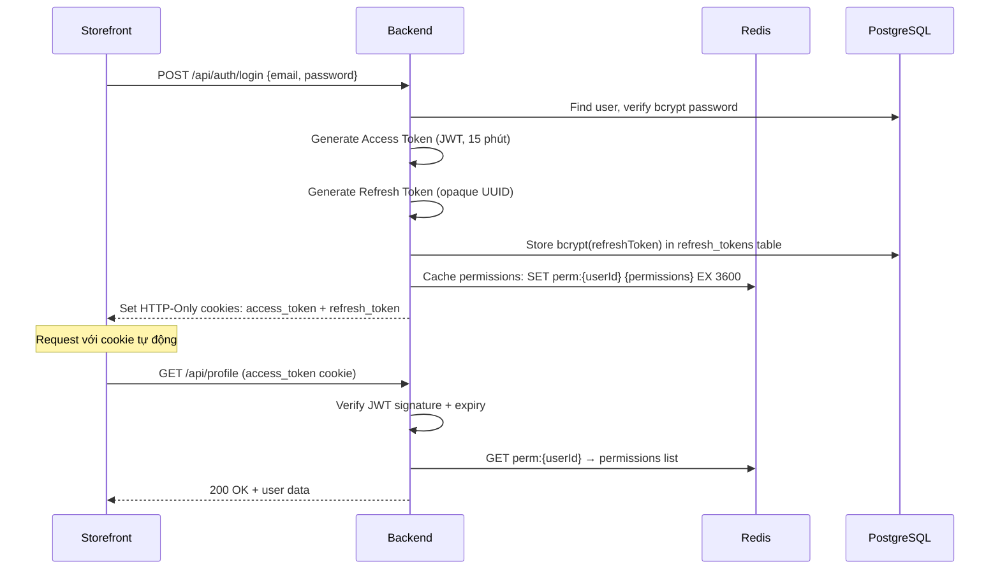
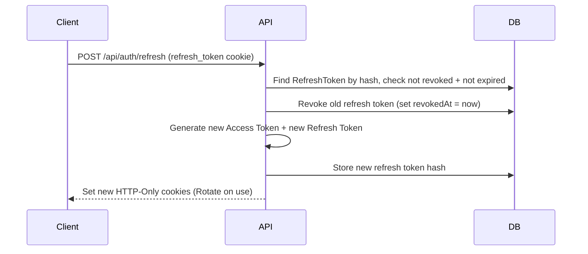

# Phân hệ Xác thực (Auth)

> Phân hệ Auth quản lý vòng đời phiên đăng nhập cho **Storefront** (khách hàng) và **Back-Office** (nhân viên vận hành) — hai hệ thống xác thực độc lập về cookie domain nhưng dùng chung JWT strategy.

---

## 1. Business Context

**Tại sao phân hệ này tồn tại?**

Ray Paradis có hai loại người dùng với security requirements khác nhau hoàn toàn:
- **Storefront users** (khách hàng): đăng nhập bằng email/password hoặc Google OAuth, session tự động refresh
- **Back-Office users** (nhân viên): đăng nhập bằng email/password do admin tạo, có audit log hành vi, không dùng OAuth

Cần tách biệt hai auth flow để phòng trường hợp storefront session bị compromise không ảnh hưởng back-office.

**Ranh giới nghiệp vụ:**
- ✅ Thuộc phạm vi: login/logout, token refresh, session management, password change
- ❌ Không thuộc phạm vi: phân quyền (→ `rbac` module), quản lý tài khoản người dùng (→ `user` module)

---

## 2. Domain Model

```prisma
model User {
  id           String   @id @default(uuid()) @db.Uuid
  email        String   @unique
  passwordHash String?  // Null nếu dùng OAuth only
  isActive     Boolean  @default(true)
  createdAt    DateTime @default(now())
}

model RefreshToken {
  id        String   @id @default(uuid()) @db.Uuid
  userId    String   @db.Uuid
  tokenHash String   @unique  // bcrypt hash của token thực — không lưu raw
  expiresAt DateTime
  revokedAt DateTime?
  userAgent String?
  ipAddress String?
}

model BackOfficeUser {
  id           String   @id @default(uuid()) @db.Uuid
  email        String   @unique
  passwordHash String
  isActive     Boolean  @default(true)
  roles        BackOfficeRole[]
}
```

---

## 3. Auth Flow

### Storefront Login Flow



### Token Refresh Flow



---

## 4. Security Measures

### HTTP-Only Cookie Configuration

```typescript
// Access Token: 15 phút
res.cookie('access_token', token, {
  httpOnly: true, secure: true, sameSite: 'strict',
  maxAge: 15 * 60 * 1000,
});

// Refresh Token: 7 ngày, path restricted
res.cookie('refresh_token', refreshToken, {
  httpOnly: true, secure: true, sameSite: 'strict',
  path: '/api/auth/refresh',  // ← Chỉ gửi đến endpoint này
  maxAge: 7 * 24 * 60 * 60 * 1000,
});
```

### CSRF Protection
Áp dụng Double Submit Cookie pattern cho POST/PATCH/DELETE requests:
- Server set `csrf_token` cookie (readable by JS)
- Client đọc và gửi trong header `X-CSRF-Token`
- Server verify hai giá trị khớp nhau

### Refresh Token Rotation
Mỗi lần refresh: token cũ bị revoke ngay lập tức, token mới được cấp. Nếu refresh token cũ được dùng lại sau khi đã rotate → **phát hiện token theft** → revoke toàn bộ sessions của user.

---

## 5. API Surface

> **Nguồn chính xác nhất**: Swagger UI `http://localhost:4000/api/docs` → tag `Auth`

| Method | Path | Mô tả |
|--------|------|--------|
| `POST` | `/api/auth/login` | Đăng nhập storefront |
| `POST` | `/api/auth/logout` | Đăng xuất, clear cookies |
| `POST` | `/api/auth/refresh` | Refresh access token |
| `POST` | `/api/auth/register` | Đăng ký tài khoản |
| `GET` | `/api/auth/google` | Bắt đầu Google OAuth flow |
| `GET` | `/api/auth/google/callback` | Callback từ Google |
| `POST` | `/api/back-office/auth/login` | Đăng nhập back-office (riêng biệt) |
| `POST` | `/api/back-office/auth/logout` | Đăng xuất back-office |

---

## 6. Permissions

Auth endpoints dành cho người dùng cuối là `@Public()` — không cần permission.

| Permission Slug | Hành động (Admin only) |
|-----------------|------------------------|
| `auth.user.create` | Tạo back-office user |
| `auth.user.read` | Xem danh sách users |
| `auth.user.update` | Cập nhật thông tin user |
| `auth.role.create` | Tạo role mới |
| `auth.user.assign-role` | Gán role cho user |

---

## 7. Events / Jobs

**Không có Domain Events** từ auth module — login/logout là synchronous operations.

**Không có BullMQ Jobs** — tất cả auth operations là real-time.

> Session cleanup (expired refresh tokens) được handle bằng database-level TTL hoặc cron job cleanup, không phải BullMQ.

---

## 8. Failure Cases

| Tình huống | Hành vi | Status |
|------------|---------|--------|
| Sai mật khẩu | `UnauthorizedException` — không tiết lộ user có tồn tại không | `401` |
| Refresh token hết hạn | `UnauthorizedException` — client redirect về trang login | `401` |
| Refresh token đã bị revoke (rotation reuse) | Revoke ALL sessions của user, return `401` | `401` |
| Access token hết hạn | `401` — client tự động call refresh endpoint | `401` |
| CSRF token không khớp | `ForbiddenException` | `403` |
| Account bị deactivate | `ForbiddenException` | `403` |

---

## 8. Testing Notes

**Test files:** `backend/src/modules/auth/__tests__/`

**Critical paths:**
- Login với valid/invalid credentials
- Refresh token rotation — cũ bị revoke, mới được cấp
- Reuse của revoked refresh token → full session revocation
- CSRF protection trên mutating endpoints

**Mock patterns:**
```typescript
// Mock bcrypt để test nhanh hơn
jest.mock('bcrypt', () => ({
  compare: jest.fn().mockResolvedValue(true),
  hash: jest.fn().mockResolvedValue('hashed'),
}));
```
