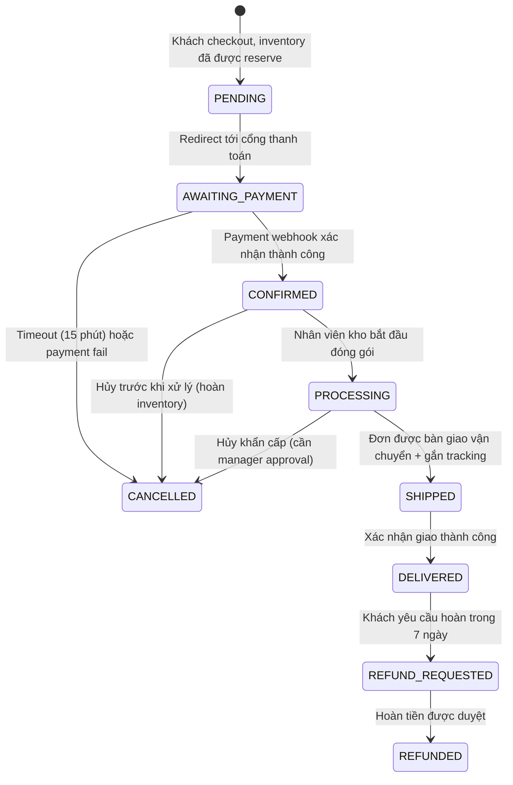

# Phân hệ Đặt hàng (Order)

> Phân hệ Order quản lý toàn bộ vòng đời đơn hàng — từ khi khách hàng checkout đến khi hàng được giao hoặc hoàn trả. Đây là phân hệ trung tâm kết nối Inventory, Payment, và Notification.

---

## 1. Business Context

**Tại sao phân hệ này tồn tại?**

Trang sức cao cấp có quy trình xử lý đơn hàng phức tạp hơn e-commerce thông thường: mỗi sản phẩm là độc bản hoặc limited stock, cần xác nhận thủ công từ nhân viên, có thể yêu cầu kiểm tra RFID trước khi giao, và cần audit trail đầy đủ cho mục đích bảo hiểm.

**Actors chính:**
- `Khách hàng` — đặt hàng, theo dõi trạng thái, yêu cầu hủy
- `Nhân viên kho` — xác nhận hàng sẵn có, đóng gói
- `Quản lý vận hành` — duyệt hoàn tiền, xử lý khiếu nại

**Ranh giới nghiệp vụ:**
- ✅ Thuộc phạm vi: lifecycle đơn hàng, tracking, cancellation, refund trigger
- ❌ Không thuộc phạm vi: xử lý thanh toán thực tế (→ `payment` module), trừ tồn kho (→ `inventory` module)

---

## 2. Domain Model

```prisma
model Order {
  id              String      @id @default(uuid()) @db.Uuid
  userId          String      @db.Uuid
  status          OrderStatus @default(PENDING)
  totalAmount     Decimal     @db.Decimal(19, 2)
  shippingAddress Json        // { fullName, phone, address, city, province }
  note            String?
  createdAt       DateTime    @default(now())
  updatedAt       DateTime    @updatedAt

  items    OrderItem[]
  payments Payment[]
}

model OrderItem {
  id               String  @id @default(uuid()) @db.Uuid
  orderId          String  @db.Uuid
  productVariantId String  @db.Uuid
  physicalItemId   String? @db.Uuid  // Gắn với PhysicalItem sau khi pack
  quantity         Int
  unitPrice        Decimal @db.Decimal(19, 2)
  snapshotName     String  // Lưu tên sản phẩm tại thời điểm đặt hàng
}
```

**Giải thích các field quan trọng:**

| Field | Ý nghĩa |
|-------|---------|
| `status` | Trạng thái hiện tại trong state machine |
| `shippingAddress` (JSON) | Snapshot địa chỉ tại thời điểm đặt — không link FK để tránh bị thay đổi sau |
| `snapshotName` | Tên sản phẩm tại thời điểm đặt hàng — tránh bị ảnh hưởng nếu product sau đó bị đổi tên |
| `physicalItemId` | Null khi tạo đơn, gán khi nhân viên kho chỉ định vật phẩm cụ thể |

---

## 3. State Machine



**Các transition quan trọng:**

| Từ | Đến | Trigger | Side effects |
|----|-----|---------|--------------|
| `AWAITING_PAYMENT` | `CONFIRMED` | Payment webhook | Deduct inventory (via Outbox), gửi email |
| `AWAITING_PAYMENT` | `CANCELLED` | BullMQ timeout job | Release inventory reservation |
| `CONFIRMED` | `CANCELLED` | Admin action | Release inventory reservation, trigger refund |

---

## 4. API Surface

> **Nguồn chính xác nhất**: Swagger UI tại `http://localhost:4000/api/docs` → tag `Orders`

| Method | Path | Mô tả |
|--------|------|--------|
| `POST` | `/api/orders` | Tạo đơn hàng mới từ cart |
| `GET` | `/api/orders` | Lịch sử đơn hàng của user |
| `GET` | `/api/orders/:id` | Chi tiết đơn hàng |
| `POST` | `/api/orders/:id/cancel` | Yêu cầu hủy đơn |
| `GET` | `/api/admin/orders` | Danh sách đơn cho admin | 
| `PATCH` | `/api/admin/orders/:id/status` | Cập nhật trạng thái thủ công |
| `POST` | `/api/admin/orders/:id/refund` | Trigger hoàn tiền |

---

## 5. Permissions

| Permission Slug | Hành động |
|-----------------|-----------|
| `order.read` | Xem đơn hàng (admin) |
| `order.update` | Cập nhật trạng thái đơn |
| `order.refund` | Duyệt hoàn tiền |
| `order.shipment.manage` | Quản lý vận chuyển |
| `order.payment.manage` | Quản lý thanh toán đơn hàng |

> Khách hàng xem đơn hàng của mình không cần permission — chỉ cần xác thực và ownership check.

---

## 6. Events / Jobs

**Domain Events (Outbox):**

| Event | Phát khi | Consumer |
|-------|----------|----------|
| `ORDER_CONFIRMED` | Payment webhook xác nhận | `inventory.worker` (deduct), `mail.worker` (email) |
| `ORDER_CANCELLED` | Hủy đơn | `inventory.worker` (release reservation) |
| `ORDER_REFUND_REQUESTED` | Khách yêu cầu hoàn | `payment.worker` (trigger refund) |

**BullMQ Jobs:**

| Queue | Job | Trigger | Chức năng |
|-------|-----|---------|-----------|
| `order-timeout` | `expire-pending-order` | Tạo lúc checkout | Tự động cancel nếu không thanh toán sau 15 phút |

---

## 7. Failure Cases

| Tình huống | Hành vi hệ thống | Status |
|------------|------------------|--------|
| Cart có sản phẩm hết hàng khi checkout | `ConflictException`: "Insufficient stock for variant X" | `409` |
| Thanh toán timeout | BullMQ job tự động cancel order + release reservation | - |
| Payment webhook duplicate | Idempotency check trên `paymentTransactionId` — bỏ qua nếu đã xử lý | `200` |
| Hủy đơn đã SHIPPED | `BadRequestException`: không thể hủy sau khi đã giao shipper | `400` |
| Concurrent checkout cùng sản phẩm độc bản | Pessimistic lock → request sau nhận `ConflictException` | `409` |

---

## 8. Testing Notes

**Test files:** `backend/src/modules/order/__tests__/`

**Critical paths cần test:**
- `createOrder`: inventory reservation thành công và fail
- `cancelOrder`: state machine transitions hợp lệ và không hợp lệ
- Timeout job: đảm bảo đơn bị cancel và inventory được release
- Payment webhook idempotency: gọi 2 lần không tạo 2 kết quả

**Mock patterns:**
```typescript
// Mock InventoryService để tách biệt test Order logic
const mockInventoryService = {
  reserveStock: jest.fn().mockResolvedValue(undefined),
  releaseReservation: jest.fn().mockResolvedValue(undefined),
};
```

**Lưu ý đặc biệt:** Test state machine transitions — đặc biệt các transition invalid phải throw exception đúng.
