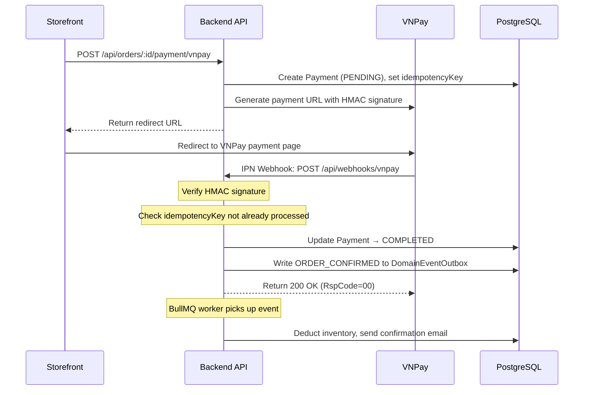
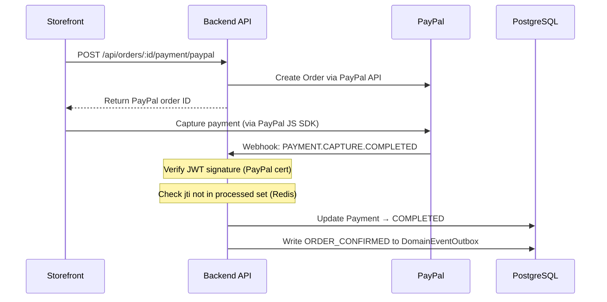

# Phân hệ Thanh toán (Payment)

> Phân hệ Payment xử lý toàn bộ vòng đời giao dịch tài chính — từ khởi tạo thanh toán, nhận webhook từ cổng thanh toán, đến hoàn tiền. Bảo vệ chống replay attacks và đảm bảo idempotency là ưu tiên hàng đầu.

---

## 1. Business Context

**Tại sao phân hệ này tồn tại?**

Ray Paradis tích hợp đa cổng thanh toán (VNPay cho thị trường Việt Nam, PayPal cho quốc tế). Mỗi cổng có webhook format khác nhau, retry policy khác nhau, và risk surface khác nhau. Phân hệ này là tầng abstraction xử lý tất cả sự phức tạp đó, để Order module không cần biết khách dùng cổng nào.

**Actors chính:**
- `Khách hàng` — chọn phương thức thanh toán, thực hiện giao dịch
- `Cổng thanh toán` — gửi webhook callback sau khi giao dịch hoàn tất
- `Quản lý tài chính` — xem lịch sử, duyệt hoàn tiền

**Ranh giới nghiệp vụ:**
- ✅ Thuộc phạm vi: initiate payment, process webhook, refund
- ❌ Không thuộc phạm vi: tạo đơn hàng (→ `order` module), trừ tồn kho (→ `inventory` module)

---

## 2. Domain Model

```prisma
model Payment {
  id                    String        @id @default(uuid()) @db.Uuid
  orderId               String        @db.Uuid
  provider              PaymentProvider // VNPAY | PAYPAL
  status                PaymentStatus   // PENDING | COMPLETED | FAILED | REFUNDED
  amount                Decimal       @db.Decimal(19, 2)
  currency              String        @db.VarChar(3)  // VND, USD
  providerTransactionId String?       @unique          // ID từ VNPay/PayPal
  idempotencyKey        String        @unique          // Chống replay
  metadata              Json?         // Raw webhook payload (for audit)
  createdAt             DateTime      @default(now())
  completedAt           DateTime?
}
```

**Giải thích field quan trọng:**

| Field | Ý nghĩa |
|-------|---------|
| `providerTransactionId` | `@unique` — đảm bảo một transaction từ VNPay/PayPal chỉ được xử lý một lần |
| `idempotencyKey` | UUID tạo phía backend — dùng để dedup webhook retry |
| `metadata` | Lưu toàn bộ raw webhook payload — phục vụ audit và dispute với ngân hàng |

---

## 3. Luồng Thanh toán

### VNPay Flow



### PayPal Flow



---

## 4. Idempotency — Chống Replay Attack

**Vấn đề**: Cổng thanh toán retry webhook nếu không nhận được 200 OK trong timeout. Hệ thống phải xử lý duplicate webhooks mà không gây double-deduct inventory hay double-confirm order.

**Giải pháp VNPay**: Check `providerTransactionId` trong database — nếu đã tồn tại, return 200 ngay mà không xử lý tiếp.

**Giải pháp PayPal**: Check `jti` (JWT ID) trong Redis SET với TTL 24h:
```typescript
const jti = extractJti(webhookToken);
const isReplayed = await this.redis.sismember('processed_jti', jti);
if (isReplayed) return { status: 'already_processed' };
await this.redis.sadd('processed_jti', jti);
await this.redis.expire('processed_jti', 86400); // 24h TTL
```

---

## 5. Permissions

| Permission Slug | Hành động |
|-----------------|-----------|
| `order.payment.manage` | Xem lịch sử thanh toán, thực hiện hoàn tiền thủ công |
| `order.refund` | Duyệt và thực thi refund |

> Webhook endpoints (`/api/webhooks/*`) là `@Public()` — không cần auth cookie. Bảo mật qua HMAC signature verification.

---

## 6. Events / Jobs

**Domain Events phát ra:**
Không phát domain events trực tiếp — Payment cập nhật trạng thái và Order module lắng nghe thông qua Outbox.

**BullMQ Jobs:**

| Queue | Job | Trigger | Chức năng |
|-------|-----|---------|-----------|
| `payment-refund` | `process-refund` | Admin trigger refund | Gọi VNPay/PayPal refund API async |

---

## 7. Failure Cases

| Tình huống | Hành vi |
|------------|---------|
| VNPay HMAC signature invalid | Log warning + return `RspCode=97` (invalid signature) |
| PayPal JWT jti đã processed | Return `200 already_processed` — không xử lý lại |
| Webhook nhận nhưng DB update fail | Transaction rollback, cổng thanh toán retry sau (eventually consistent) |
| Refund API call tới VNPay fail | BullMQ retry 3 lần với exponential backoff; sau đó alert manual |
| Payment timeout (khách không thanh toán) | Order timeout job cancel đơn — payment record giữ nguyên status PENDING cho audit |

---

## 8. Testing Notes

**Test files:** `backend/src/modules/payment/__tests__/`

**Critical paths cần test:**
- VNPay HMAC signature verification (valid và tampered signature)
- Idempotency: cùng `providerTransactionId` gọi 2 lần → kết quả giống nhau
- PayPal JWT jti dedup via Redis

**Mock patterns:**
```typescript
// Mock VNPay signature verification
jest.spyOn(vnpayService, 'verifySignature').mockReturnValue(true);

// Mock Redis cho jti check
const mockRedis = { sismember: jest.fn().mockResolvedValue(0), sadd: jest.fn() };
```

**Lưu ý đặc biệt:** Test webhook handlers phải kiểm tra cả trường hợp database transaction fail giữa chừng — đảm bảo không partial update.
