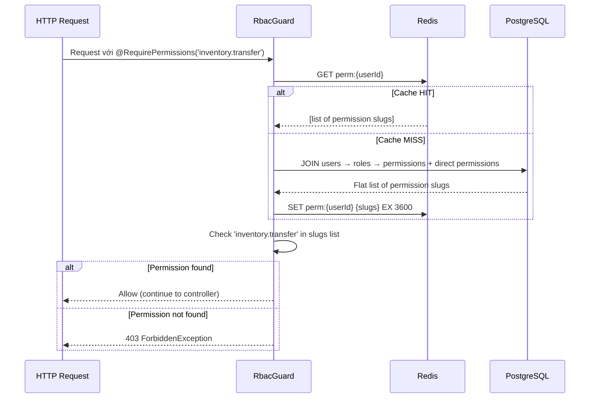

# Phân hệ Phân quyền (RBAC/ABAC)

> Phân hệ RBAC kết hợp ABAC là nền tảng bảo mật của toàn bộ hệ thống back-office. Permission trees được cache trong Redis để tránh database joins lặp lại trên mỗi request.

---

## 1. Business Context

**Tại sao phân hệ này tồn tại?**

Back-office có nhiều loại nhân sự với quyền hạn khác nhau: nhân viên kho chỉ xem/tạo inventory transfer, quản lý showroom duyệt transfer của chi nhánh mình, CFO xem ledger toàn hệ thống. Cần hệ thống phân quyền linh hoạt, granular đến mức hành động cụ thể trên từng resource.

**Actors chính:**
- `Super Admin` — full access, cấu hình toàn bộ roles
- `Quản lý` — quản lý nhân viên trong phạm vi mình
- `Nhân viên` — quyền hạn theo role được gán

**Ranh giới nghiệp vụ:**
- ✅ Thuộc phạm vi: role management, permission assignment, guard enforcement, cache management
- ❌ Không thuộc phạm vi: authentication (→ `auth` module), business logic của từng module

---

## 2. Domain Model

```prisma
model Role {
  id          String       @id @default(uuid()) @db.Uuid
  name        String       @unique
  description String?
  permissions RolePermission[]
  users       UserRole[]
}

model Permission {
  id    String           @id @default(uuid()) @db.Uuid
  slug  String           @unique  // e.g., 'inventory.transfer'
  roles RolePermission[]
  users UserPermission[] // Direct permission override
}

model UserRole {
  userId String @db.Uuid
  roleId String @db.Uuid
  @@id([userId, roleId])
}

model UserPermission {
  userId       String  @db.Uuid
  permissionId String  @db.Uuid
  granted      Boolean @default(true)  // false = explicit deny (ABAC)
  @@id([userId, permissionId])
}
```

**Mô hình phân quyền:**
```
User → [Roles] → [Permissions]  (RBAC layer)
User → [Direct Permissions]     (ABAC override: grant hoặc explicit deny)
```

Khi evaluate permission cho một user: `(permissions from all roles) UNION (direct granted permissions) MINUS (direct denied permissions)`

---

## 3. Permission Resolution Flow



**Cache Invalidation**: Redis cache bị xóa ngay khi:
- Role của user thay đổi
- Permission trong role thay đổi
- Direct permission của user thay đổi

---

## 4. Cách Sử dụng trong Code

```typescript
// Controller — áp dụng permission guard
@Get('transfers')
@RequirePermissions(PERMISSIONS.INVENTORY.TRANSFER)
async getTransfers() { ... }

// Cho phép truy cập không cần auth (public endpoint)
@Get('products')
@Public()
async getPublicProducts() { ... }

// Multiple permissions (user cần CÓ TẤT CẢ)
@Post('transfer/approve')
@RequirePermissions(PERMISSIONS.INVENTORY.TRANSFER, PERMISSIONS.INVENTORY.MANAGE)
async approveTransfer() { ... }
```

---

## 5. API Surface

> **Nguồn chính xác nhất**: Swagger UI `http://localhost:4000/api/docs` → tag `RBAC`

| Method | Path | Mô tả |
|--------|------|--------|
| `GET` | `/api/admin/roles` | Danh sách roles |
| `POST` | `/api/admin/roles` | Tạo role mới |
| `PATCH` | `/api/admin/roles/:id` | Cập nhật role |
| `DELETE` | `/api/admin/roles/:id` | Xóa role |
| `POST` | `/api/admin/roles/:id/permissions` | Gán permissions cho role |
| `POST` | `/api/admin/users/:id/roles` | Gán role cho user |
| `POST` | `/api/admin/users/:id/permissions` | Direct permission override |

---

## 6. Permissions

| Permission Slug | Hành động |
|-----------------|-----------|
| `auth.role.create` | Tạo role mới |
| `auth.role.read` | Xem danh sách roles và permissions |
| `auth.role.update` | Sửa role |
| `auth.role.delete` | Xóa role |
| `auth.user.assign-role` | Gán/xóa role của user |
| `auth.user.assign-permission` | Gán direct permission |

---

## 7. Events / Jobs

**Không có BullMQ Jobs** — tất cả permission operations là synchronous.

**Cache Invalidation** xảy ra synchronous sau mỗi mutation:
```typescript
// Sau khi thay đổi role/permission
await this.redis.del(`perm:${userId}`);
```

---

## 8. Failure Cases

| Tình huống | Hành vi | Status |
|------------|---------|--------|
| Permission không tồn tại | `NotFoundException` | `404` |
| Xóa role đang được gán cho user | `ConflictException` — phải remove role khỏi user trước | `409` |
| Redis down | Fallback về query DB trực tiếp (không cache) | - |
| User không có permission | `ForbiddenException` từ Guard | `403` |
| Cache stale (race condition) | TTL 1h — tối đa 1h sau khi permission thay đổi là cache tự expire | - |

---

## 8. Testing Notes

**Test files:** `backend/src/modules/rbac/__tests__/`

**Critical paths:**
- Guard cho phép đúng user có permission
- Guard block user thiếu permission
- Cache invalidation sau khi role assignment thay đổi
- ABAC explicit deny override RBAC grant

**Lưu ý đặc biệt:** 
- Phải seed permission data trước khi test RBAC guard
- Test cache miss path và cache hit path riêng biệt
- Test explicit deny (ABAC) có override role permission không
